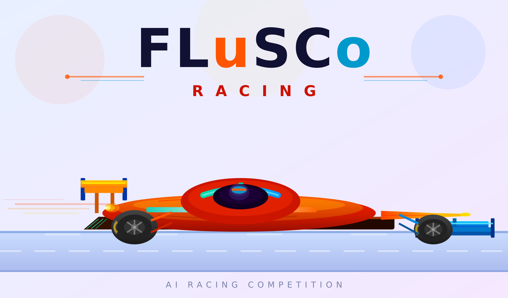
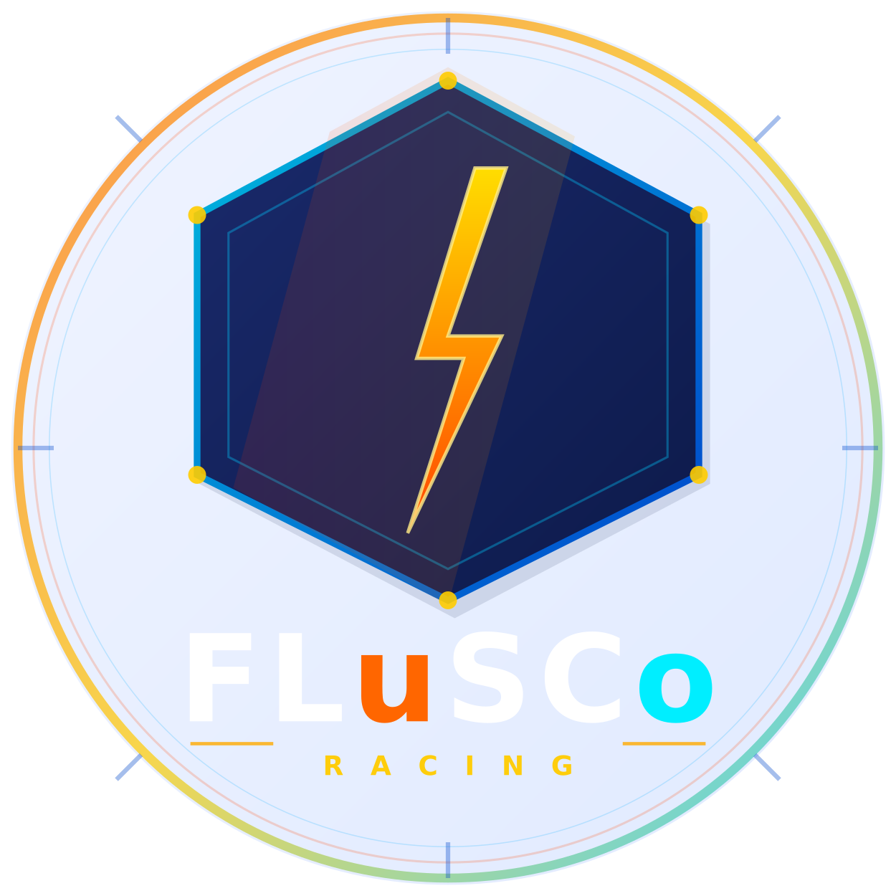

<div align="center">





# FLuSCo Racing
### IBM AI Racing League 2026 — Gruppo 13

[](https://www.python.org/)
[](https://pytorch.org/)
[](LICENSE)

**Università degli Studi di Salerno**  
Dipartimento di Ingegneria dell'Informazione ed Elettrica e Matematica Applicata  
Corso: Intelligenza Artificiale: Metodi e Applicazioni — A.A. 2025/2026

</div>

---

## 🏁 Il Progetto

FLuSCo Racing è un agente di guida autonoma per il simulatore **TORCS** (The Open Racing Car Simulator), sviluppato per la competizione **IBM AI Racing League 2026**.

L'agente impara a guidare tramite **Behavioral Cloning**: una rete neurale MLP osserva e imita un pilota bot rule-based, trasformando il problema di guida autonoma in un task di Supervised Learning.

### Risultato ottenuto
> 🏎️ **Giro completato sul circuito Corkscrew in 1:48:55 · 227 km/h · 0 danni**

---

## 👥 Il Team

| Nome | Matricola |
|------|-----------|
| Luisa Ingenito | 0612800302 |
| Silvia Liguoro | 0612800378 |
| Lucia Monetta | 0612709620 |
| Cosimo Rivellini | 0612708916 |

**Docenti:** Prof. Mario Vento · Prof.ssa Alessia Saggese

---

## 🗂️ Struttura del Repository

```
LavoroFLuSCoRace/
├── dataset/
│   └── bot_dataset.csv          # Dataset raccolto dal bot (1.057.474 righe)
└── gym_torcs/
    ├── bot.py                   # Fase 1: raccolta dati con bot rule-based
    ├── train.py                 # Fase 2: training rete neurale DrivingMLP
    ├── drive.py                 # Fase 3: inferenza in pista in tempo reale
    ├── output/
    │   ├── driving_mlp_best.pth # Pesi del modello addestrato
    │   └── scaler.joblib        # StandardScaler salvato
    ├── snakeoil3_gym.py         # Comunicazione UDP con TORCS (bot.py)
    └── snakeoil3_jm2.py         # Comunicazione UDP con TORCS (drive.py)
```

---

## ⚙️ Pipeline

La pipeline si articola in **3 fasi sequenziali**:

### Fase 1 — Raccolta Dati (`bot.py`)
Un bot rule-based deterministico guida autonomamente in TORCS e registra i dati di guida in `bot_dataset.csv`. Il bot calcola lo sterzo in base all'angolo e alla posizione in pista, gestisce i pedali tramite i sensori laser e cambia marcia in base agli RPM. Il sistema resetta automaticamente in caso di uscita di pista o auto bloccata.

- **Dataset:** 1.057.474 righe · ~350 minuti di guida simulata
- **26 input:** 7 variabili dinamiche (`angle`, `speedX`, `speedY`, `speedZ`, `trackPos`, `rpm`, `gear`) + 19 sensori laser (`track_0`…`track_18`)
- **3 output:** `steer` ∈ [−1,+1] · `accel` ∈ [0,+1] · `brake` ∈ [0,+1]

### Fase 2 — Behavioral Cloning (`train.py`)
La rete neurale **DrivingMLP** viene addestrata sui dati raccolti tramite Weighted MSE Loss.

**Architettura Multi-Head:**
```
Input (26) → Dense(256, ReLU) → Dense(128, ReLU) → Dense(64, ReLU)
                                                          │
                                    ┌─────────────────────┴─────────────────────┐
                               Steer Head                                  Pedal Head
                            Dense(1) + Tanh                            Dense(2) + Sigmoid
                              [−1, +1]                                      [0, +1]
```

**Training:**
- Ottimizzatore: AdamW (lr=1e-4)
- Loss: Weighted MSE — steer ×5.0, accel/brake ×1.0
- Split: 85% train / 15% validation
- Early stopping (patience=15) — Best val loss: **0.000757** (epoca 85)

### Fase 3 — Inferenza in Pista (`drive.py`)
Il modello addestrato guida autonomamente in TORCS in tempo reale a **50Hz**. Include:
- **Soft track-keeping:** correzione progressiva dello sterzo quando `|trackPos| > 0.75`
- **Edge braking:** frenata preventiva quando `|trackPos| > 0.70` e velocità > 100 km/h
- **Safety net:** TCS, ABS, anti-sovrasterzo (disabilitabile con `--raw`)
- **Stuck recovery:** retromarcia automatica se l'auto è ferma per più di 5 secondi

---

## 🚀 Come Usare

### Prerequisiti
```bash
pip install torch scikit-learn pandas numpy joblib pynput
```

### 1. Raccolta Dati
```bash
# Avvia TORCS, poi:
cd gym_torcs
python bot.py
```

### 2. Training
```bash
cd gym_torcs
python train.py --csv "../dataset/bot_dataset.csv" --out-dir ./output
```

### 3. Guida Autonoma
```bash
# Avvia TORCS in modalità gara, poi:
cd gym_torcs
python drive.py

# Per testare il modello puro (senza safety net):
python drive.py --raw

# Opzioni avanzate:
python drive.py --port 3001 --model output/driving_mlp_best.pth --scaler output/scaler.joblib
```

---

## 📊 Risultati

| Metrica | Valore |
|---------|--------|
| Best Val Loss | 0.000757 (epoca 85) |
| Epoca di early stop | 100 |
| Tempo sul giro (Corkscrew) | 1:48:55 |
| Velocità massima | 227 km/h |
| Danni | 0 |

---

## 🛠️ Stack Tecnologico

| Libreria | Utilizzo |
|----------|----------|
| **PyTorch** | Definizione e training della rete neurale DrivingMLP |
| **scikit-learn** | Normalizzazione input con StandardScaler |
| **pandas + NumPy** | Caricamento e preprocessing del dataset CSV |
| **SnakeOil** | Comunicazione UDP con TORCS |
| **pynput** | Attivazione modalità accelerata in TORCS |

---

## 📄 Documentazione

Il report tecnico completo del progetto è disponibile nel repository.

---

<div align="center">

**FLuSCo Racing** · IBM AI Racing League 2026 · Università degli Studi di Salerno

</div>
